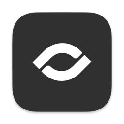
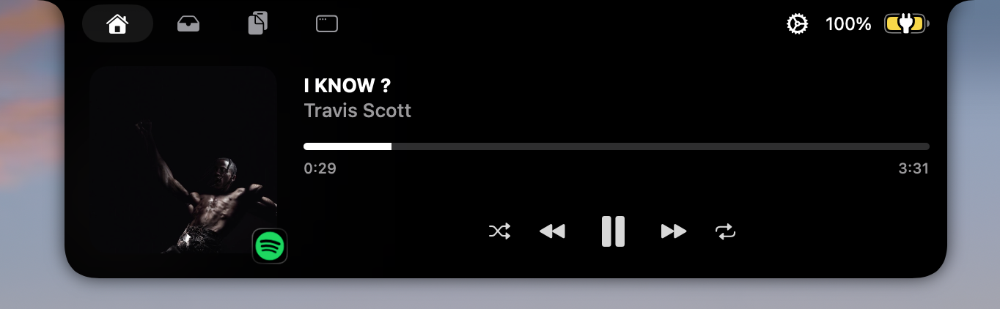

<h1 align="center">
  <br>
  
  <br>
  Gojo
  <br>
</h1>

<p align="center">
  <em>Turn the MacBook notch into a control surface for everything you actually use.</em>
</p>

<p align="center">
  <a href="https://github.com/rohoswagger/gojo/releases/latest"></a>
  <a href="https://github.com/rohoswagger/gojo/actions/workflows/build.yml"></a>
  <a href="./LICENSE"></a>
  
</p>

---

Gojo expands the dead space around your MacBook's notch into a focused, tab-driven HUD. Music, clipboard history, a drag-and-drop file shelf, window management, night shift, and more — all accessed by hovering the notch.

## Features

### Window snapping

Stage strip of on-screen apps with real app icons, a live monitor preview, and six snap actions (left / right / top / bottom halves, fill, zoom). Cross-app: click any window, snap it. Every chip surfaces its keyboard shortcut underneath.

<p align="center"></p>

### Music

Now-playing surface that follows whatever's playing — Apple Music, Spotify, browser audio. Scrubs, switches, and renders artwork in the notch's album-art slot.

<p align="center"></p>

### Clipboard history

Recent clipboard items, browsable from the notch. Pin entries, search, paste back into the focused app. Automatically excludes password managers.

<!-- <p align="center"></p> -->

### Drag-and-drop shelf

Drop files into the notch from anywhere; pick them up later from any other app. Lightweight staging without a Finder tab open.

<!-- <p align="center"></p> -->

### Night shift

f.lux-style color temperature control built into the notch. Schedule-based transitions, location-aware sunset detection, and manual pause.

### Calendar & Reminders

Next-up events and reminders glanceable when the notch opens. Per-calendar and per-list toggling.

### Webcam mirror

Quick selfie view for camera-positioning before a call.

<!-- <p align="center"></p> -->

### Battery

Battery percentage and power status notifications in the notch.

### First-run onboarding

A guided first launch opens with an animated aperture welcome, walks you through the optional permissions and your music source, and finishes with a hello flourish in the notch itself.

## Install

> Requires macOS 14 Sonoma or later. Apple Silicon and Intel both supported.

### Latest release

1. Download **Gojo-x.y.z.dmg** from the [latest release](https://github.com/rohoswagger/gojo/releases/latest).
2. Open the DMG and drag **Gojo.app** into **Applications**.
3. **Run this once** to launch it (see below).

> [!IMPORTANT]
> Gojo isn't notarized yet, so on first launch macOS will say it's **"damaged"** or that it **can't verify the developer**. This is expected — clear the quarantine flag, then open it normally:
>
> ```bash
> xattr -dr com.apple.quarantine /Applications/Gojo.app
> ```
>
> You only need to do this once.

Updates after that are delivered automatically via [Sparkle](https://sparkle-project.org/).

### Build from source

```bash
git clone https://github.com/rohoswagger/gojo.git
cd gojo
make run
```

`make run` builds the Debug app, stops any existing dev process, and launches it. Other useful targets:

| Command | Effect |
|---------|--------|
| `make build` | Build only |
| `make stop` | Kill running dev instances |
| `make restart` | Stop + build + launch |
| `make clean` | Remove `.build/` artifacts |

You can also open `Gojo.xcodeproj` in Xcode and run normally.

### Releasing

Maintainers cut signed, notarized releases from a local machine with a single command:

```bash
make release VERSION=1.0.0       # build → sign → notarize → DMG → Sparkle-sign → appcast → GitHub Release
make release-dry VERSION=1.0.0   # same, but stop before publishing
```

See [RELEASING.md](./RELEASING.md) for one-time setup (signing certificate, App Store Connect API key, Sparkle keys, GitHub Pages) and the full cut-a-release checklist.

## Permissions

Gojo asks for a few macOS permissions on first use of the relevant feature:

| Permission | Why |
|------------|-----|
| **Accessibility** | Required for the window manager — read and resize windows of other apps via AX. |
| **Apple Events** | Reading the now-playing track from Music/Spotify. |
| **Camera** | Optional, for the webcam mirror. |
| **Calendar & Reminders** | Optional, for displaying upcoming events and reminders. |

Permissions are granted via **System Settings → Privacy & Security**. The `GojoXPCHelper` XPC service is the process that holds the Accessibility grant — Gojo proxies AX-trusted work through it.

## Keyboard shortcuts

Defaults — all rebindable in **Settings → Shortcuts**.

### Global

| Action | Shortcut |
|--------|----------|
| Open clipboard history panel | ⇧⌘C |
| Toggle notch open | ⇧⌘I |
| Toggle sneak peek | ⇧⌘H |
| Toggle microphone | fn-F5 |

### Window manager

| Action | Shortcut |
|--------|----------|
| Snap to left half | ⌃⌥← |
| Snap to right half | ⌃⌥→ |
| Snap to top half | ⌃⌥↑ |
| Snap to bottom half | ⌃⌥↓ |
| Maximize (fill) | ⌃⌥↩ |
| Zoom (default size) | ⌃⌥Z |

## Architecture

Gojo is two targets that talk over XPC:

- **`Gojo.app`** — the SwiftUI host app. Owns the notch window, the views, music/clipboard/shelf/webcam managers, and most of the UI logic.
- **`GojoXPCHelper.xpc`** — bundled XPC service. Holds the Accessibility authorization and performs AX-trusted operations (window enumeration, raise, frame set, zoom). Isolating AX in a separate process makes the trust model cleaner and lets the main app run without elevated permissions.

Auto-update is provided by Sparkle via the appcast at `https://rohoswagger.github.io/gojo/appcast.xml` (EdDSA-signed updates).

## Troubleshooting

**Window snaps aren't moving the right window**
Open **System Settings → Privacy & Security → Accessibility**, make sure **Gojo** is checked. The window manager talks through the helper, which needs AX trust.

**Clipboard history isn't capturing**
Gojo only sees changes while it's running. Launch Gojo first, then copy. If you toggle **Launch at login** in Settings, history starts being captured at boot.

**Notch doesn't show on a connected display**
Settings → General → Display lets you pick which screen Gojo lives on, and whether to mirror it across all displays.

**App is blocked on first launch**
macOS quarantine; run `xattr -dr com.apple.quarantine /Applications/Gojo.app` and re-open.

## Contributing

See [CONTRIBUTING.md](./CONTRIBUTING.md). Issues and PRs welcome — please search existing issues first.

## Security

See [SECURITY.md](./SECURITY.md) for the responsible-disclosure flow.

## License

Gojo is licensed under the [GNU General Public License v3.0](./LICENSE).

- Third-party licenses — [THIRD_PARTY_LICENSES](./THIRD_PARTY_LICENSES)
- Provenance — [NOTICE.md](./NOTICE.md)

## Acknowledgments

Built on Sparkle, KeyboardShortcuts, Defaults, swift-collections, Lottie, Pow, SkyLightWindow, MacroVisionKit, AsyncXPCConnection, swiftui-introspect, and LaunchAtLogin.
